# Uživatelský manuál ATPU

Verze dokumentu: 2026-08-18
## Obsah
- [1 Úvod a základní princip](#1-úvod-a-základní-princip)
- [2 Doporučený pracovní postup](#2-doporučený-pracovní-postup)
- [3 Hlavní menu a navigace](#3-hlavní-menu-a-navigace)
- [4 Úvodní stránka a inicializace](#4-úvodní-stránka-a-inicializace)
- [5 Import dat ze STAGu](#5-import-dat-ze-stagu)
- [6 Manuální editace přímé výuky A.1](#6-manuální-editace-přímé-výuky-a-1)
- [7 Zkoušení A.2](#7-zkoušení-a-2)
- [8 Editace počtu studentů v ročnících](#8-editace-počtu-studentů-v-ročnících)
- [9 Cvičení studijního ročníku](#9-cvičení-studijního-ročníku)
- [10 Rozdělení cvičení podle počtu studentů](#10-rozdělení-cvičení-podle-počtu-studentů)
- [11 Přidání externisty](#11-přidání-externisty)
- [12 Přehled učitelů](#12-přehled-učitelů)
- [13 Detail úvazku učitele](#13-detail-úvazku-učitele)
- [14 Detail a editace učitele](#14-detail-a-editace-učitele)
- [15 Nepokrytá výuka](#15-nepokrytá-výuka)
- [16 Nastavení systému](#16-nastavení-systému)
- [17 Rozcestník Edit](#17-rozcestník-edit)
- [18 Exportní stránky](#18-exportní-stránky)
- [19 Technické a ladicí stránky](#19-technické-a-ladicí-stránky)
- [20 Přehled propojení mezi stránkami](#20-přehled-propojení-mezi-stránkami)
- [21 Kontrolní seznam před exportem](#21-kontrolní-seznam-před-exportem)
# 1 Úvod a základní princip

ATPU je webová aplikace pro sestavení pracovních úvazků akademických pracovníků. Aplikace pracuje s daty z IS/STAG, ukládá je do lokální databáze po verzích, automaticky předvyplňuje výuku podle historických dat a umožňuje ruční kontrolu přímé výuky A.1, zkoušení A.2, počtu studentů a výsledných exportů.

# 2 Doporučený pracovní postup

Spusťte aplikaci přes Docker nebo lokální webový server a otevřete úvodní stránku.

Při prvním spuštění inicializujte databázi tlačítkem Start.

Na stránce Import dat zadejte přihlašovací údaje do IS/STAG a nechte aplikaci ověřit spojení.

Vytvořte nebo aktivujte verzi dat. Každá verze odděluje samostatný import a následné úpravy.

Zkontrolujte nebo nastavte akademický rok. Výběr roku určuje, pro jaký rok se stahují předměty.

Spusťte kompletní import celé UTB. Během importu sledujte stavový panel a poslední řádek logu.

Po importu nastavte, zda se mají zahrnovat anglické výuky.

Doplňte počty studentů v ročnících a podle potřeby rozdělte cvičení na více skupin.

V Manuální editaci A.1 zkontrolujte učitele, podíly, typ výuky, jazyk, druh předmětu a maximum studentů.

Na stránce Zkoušení A.2 doplňte počty zápočtů, zkoušek a dalších aktivit.

Zkontrolujte Přehled učitelů, Detail úvazku a Nepokrytou výuku.

Proveďte export požadovaných úvazků nebo přehledů do Excelu.

# 3 Hlavní menu a navigace

Hlavní menu propojuje všechny klíčové stránky aplikace. Na úvodní stránce je menu zobrazené přímo, na dalších stránkách se používá společný navigační panel.

## Ovládací prvky a tlačítka

| Prvek / tlačítko | Funkce | Návaznost |
| --- | --- | --- |
| Main | Přechod na úvodní stránku aplikace. | Slouží jako výchozí bod a obsahuje inicializaci databáze. |
| View | Zobrazení základních dat a sestav z databáze. | Navazuje na importovaná data aktuální verze. |
| Edit | Rozcestník pro pomocné editace. | Otevírá přidání externisty, počty studentů a rozdělení cvičení. |
| Import dat | Správa verzí, STAG přihlášení, import a nastavení AJ výuk. | Předchází většině dalších kroků práce. |
| Manuální editace (A.1) | Ruční kontrola přímé výuky. | Výsledek vstupuje do výpočtu úvazků a exportu. |
| Zkoušení (A.2) | Editace počtů zkoušek a zápočtů. | Doplňuje druhou část výpočtu pracovního úvazku. |
| Rozdělit cvičení | Dopočítání skupin cvičení podle počtu studentů. | Vychází z počtů studentů a maxima na skupinu v A.1. |
| Přehled učitelé | Seznam vyučujících s vytížeností. | Obsahuje export vybraných učitelů a odkazy na detail. |
| Nepokrytá výuka | Kontrola předmětů bez plného pokrytí. | Vrací uživatele do manuální editace konkrétního předmětu. |
| Nastavení | Koeficienty, hranice přetížení, plný úvazek a tituly. | Ovlivňuje výpočet PB a zobrazení vytíženosti. |

## Screenshot

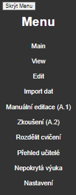

# 4 Úvodní stránka a inicializace

Úvodní stránka slouží ke spuštění aplikace a k první inicializaci databáze. Inicializace vytvoří nebo doplní základní tabulky a výchozí data, bez kterých další funkce nemusejí fungovat.

## Ovládací prvky a tlačítka

| Prvek / tlačítko | Funkce | Návaznost |
| --- | --- | --- |
| Start | Spustí inicializační funkci databáze. | Používá se při prvním spuštění nebo po vytvoření nové prázdné databáze. |
| Menu | Odkazy na hlavní části aplikace. | Po inicializaci uživatel pokračuje na Import dat. |

## Poznámky k použití

- Tlačítko Start nemaže uživatelské výstupy, ale připravuje databázovou strukturu a výchozí nastavení podle implementace aplikace.

## Screenshot

# 5 Import dat ze STAGu

Stránka Import dat je hlavní administrační obrazovka pro práci s verzemi, akademickým rokem, přihlašovacími údaji do IS/STAG, hromadným importem a nastavením anglických výuk.

## Ovládací prvky a tlačítka

| Prvek / tlačítko | Funkce | Návaznost |
| --- | --- | --- |
| STAG přihlašovací jméno | Zadání uživatelského jména pro webové služby IS/STAG. | Použije se pouze pro aktuální session při volání STAG služeb. |
| STAG heslo | Zadání hesla k IS/STAG. | Heslo se neukládá do repozitáře, config souboru ani databáze. |
| Uložit do session | Uloží údaje do session a ověří je proti IS/STAG. | Při neúspěchu se import nespustí a zobrazí se chyba spojení nebo autorizace. |
| Odstranit údaje ze session | Odstraní uložené STAG údaje z aktuální session. | Po odstranění je nutné údaje před dalším importem zadat znovu. |
| Vytvořit verzi | Založí novou datovou verzi a nastaví ji jako aktivní. | Všechny importy a úpravy se vztahují k aktivní verzi. |
| Aktivovat verzi | Přepne aplikaci na vybranou existující verzi. | Ovlivní výpisy, editace, exporty, pracoviště, učitele i předměty. |
| Nastavit rok | Uloží akademický rok pro import. | Rok se používá při stahování předmětů; loňský rok se používá pro historické přiřazení. |
| Spustit kompletní import (celá UTB) | Stáhne data pro fakulty UTB a jejich pracoviště. | Vytvoří podklady pro manuální editaci, zkoušení, přehledy a exporty. |
| Předvyplnit zkouseni_prirazeni | Doplní záznamy A.2 z aktuálních dat. | Používá se, pokud A.2 v exportu chybí, ale data předmětů a učitelů jsou v databázi. |
| Zahrnout anglické výuky | Určí, zda se AJ výuky zobrazují a započítávají. | Ovlivňuje Manuální editaci, Přehled učitele a exporty. |
| Odebrat učitele z AJ výuk | Nastaví učitele u anglických výuk na prázdnou hodnotu. | Používejte pouze po vědomém rozhodnutí; akce se vrací ručně nebo re-importem. |

## Poznámky k použití

- Během dlouhých importů se zobrazí stavový panel. Panel ukazuje obecnou stavovou informaci, čas běhu a poslední dostupný řádek importního logu.

- Kompletní log importu se ukládá do souboru ve složce logs/importy. Na stránce se kvůli výkonu zobrazuje jen posledních 10 řádků a odkaz na celý log.

- Pokud se objeví chyba Connection refused, nejde typicky o špatné heslo, ale o problém spojení na server stag-ws.utb.cz z dané sítě nebo Docker prostředí.

## Screenshot

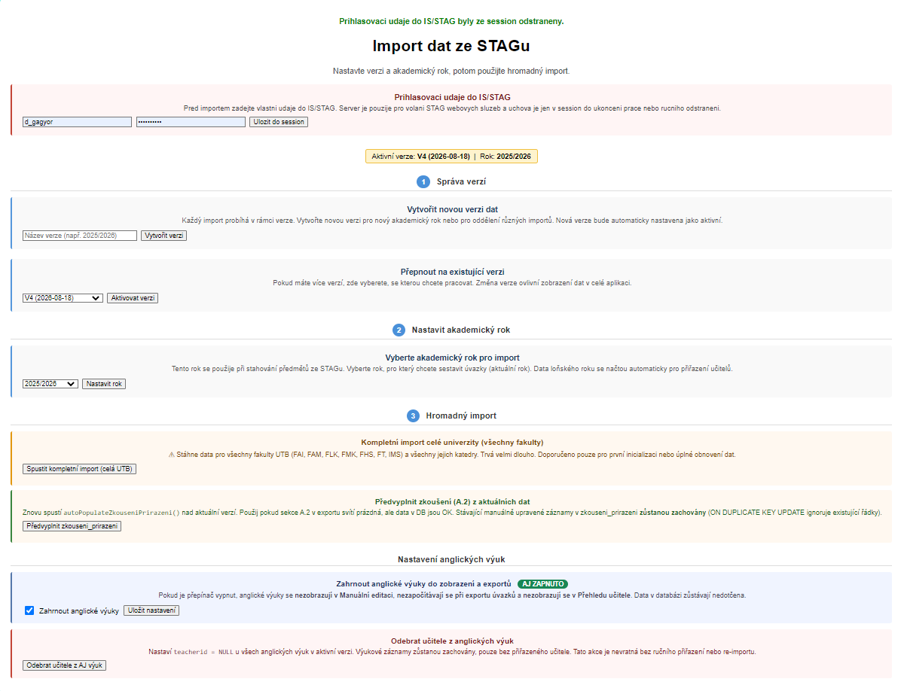

# 6 Manuální editace přímé výuky A.1

Manuální editace slouží k úpravě přiřazení učitelů k předmětům v části A.1. Stránka pracuje pouze s aktivní verzí dat; předměty, učitelé i pracoviště se filtrují podle této verze.

## Ovládací prvky a tlačítka

| Prvek / tlačítko | Funkce | Návaznost |
| --- | --- | --- |
| Fakulta | Omezí výpis na předměty vybrané fakulty. | Využívá pracoviště načtená v aktivní verzi. |
| Katedra | Omezí výpis na jednu katedru nebo pracoviště. | Hodnota se ukládá pro aktivní verzi. |
| Název / Zkratka | Textové hledání předmětu. | Usnadňuje opravu konkrétního předmětu. |
| Učitel | Filtr podle vyučujícího nebo podle záznamů bez učitele. | Navazuje na seznam učitelů aktuální verze. |
| Semestr | Omezí výpis na ZS nebo LS. | Používá se také při návratu z detailů. |
| Jen učitelé fakulty daného předmětu | V rozbalovacím seznamu řádku omezí učitele podle fakulty předmětu. | Aktuálně přiřazený učitel mimo filtr zůstává viditelný, aby nebyl omylem odebrán. |
| Uložit vše na stránce | Uloží všechny upravené řádky z aktuální stránky. | Ukládá jen záznamy předané z aktuální verze. |
| Typ výuky | Nastaví přednášku, cvičení nebo seminář. | Ovlivňuje výpočet PB a barevné odlišení řádku. |
| Druh pro PB | Určuje, zda jde o běžný, cizojazyčný, doktorský nebo doktorský cizojazyčný předmět. | Ovlivňuje koeficient v části A.1. |
| Podíl | Nastaví procentuální podíl vyučujícího na dané části výuky. | Součet podílů se používá při kontrole nepokryté výuky. |
| Jazyk | Nastaví jazyk výuky. | Spolu s nastavením AJ ovlivňuje zobrazení a export. |
| Učitel | Přiřadí vyučujícího nebo ponechá výuku bez učitele. | Výběr používá učitele z aktivní verze. |
| Max. počet | Nastaví maximum studentů na skupinu cvičení. | Využívá stránka Rozdělit cvičení. |
| Uložit | Uloží jeden konkrétní řádek. | Zachová aktuální filtry a stránkování. |
| Odebrat | Vymaže učitele z řádku a ponechá výukovou část. | Řádek se může objevit v Nepokryté výuce. |
| Smazat | Odstraní přiřazení výuky. | Používejte opatrně, pokud má být část výuky úplně odstraněna. |
| Kopírovat | Vytvoří kopii přiřazení jako nový řádek. | Hodí se pro rozdělení výuky mezi více vyučujících. |
| Vybrat vše na stránce | Označí všechny řádky zobrazené na aktuální stránce Manuální editace. | Používá se před hromadnými akcemi nad vybranými řádky. |
| Odebrat vybrané | Hromadně odebere učitele z označených řádků, ale ponechá samotné výukové záznamy. | Vhodné pro čištění importovaných přiřazení, která mají zůstat jako nepokrytá výuka. |
| Smazat vybrané | Hromadně smaže označené řádky přiřazení. | Používejte pouze u výuky nebo balastních řádků, které nemají být v A.1 vůbec zahrnuty. |
| Odebrat vše vyfiltrované | Odebere učitele ze všech záznamů odpovídajících aktuálním filtrům, nejen z aktuální stránky. | Před akcí se zobrazí potvrzení s počtem zasažených záznamů. |
| Smazat vše vyfiltrované | Smaže všechny záznamy odpovídající aktuálním filtrům. | Destruktivní akce určená pro odstranění většího množství balastních dat ze STAGu. |

## Poznámky k použití

- U každé ukládací akce se kontroluje IdVerze. Pokud záznam v aktivní verzi neexistuje, aplikace jej neupraví.

- Při hledání podle zkratky se může zobrazit upozornění na nespárované učitele z loňského rozvrhu.

## Screenshot

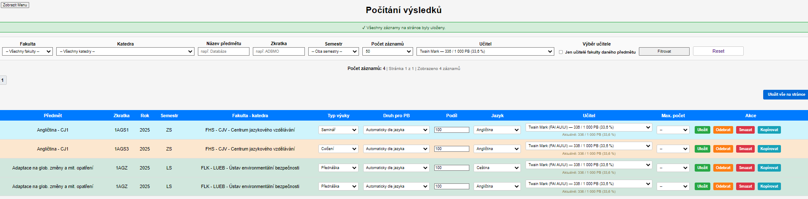

# 7 Zkoušení A.2

Stránka Zkoušení A.2 slouží k editaci počtů klasifikovaných zápočtů, zápočtů, zkoušek a dílčích zkoušek. Tyto hodnoty se převádějí přes koeficienty na pracovní body.

## Ovládací prvky a tlačítka

| Prvek / tlačítko | Funkce | Návaznost |
| --- | --- | --- |
| Učitel | Filtruje záznamy podle vyučujícího. | Používá učitele aktivní verze. |
| Zkratka | Vyhledá předmět podle zkratky. | Pomáhá při kontrole konkrétního předmětu. |
| Semestr | Omezí data na ZS nebo LS. | Zachovává se při ukládání. |
| Počet na stránce | Nastaví stránkování na 50 nebo 100 řádků. | Zlepšuje přehlednost většího importu. |
| pocet_kl / pocet_zap / pocet_zk / pocet_dz | Editovatelné počty aktivit A.2. | Hodnoty vstupují do výpočtu PB. |
| Uložit | Uloží jeden řádek A.2. | Ukládá pouze záznam aktivní verze. |

## Screenshot

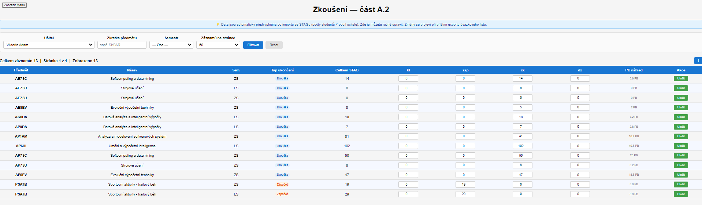

# 8 Editace počtu studentů v ročnících

Po uložení počtu studentů lze u každého řádku použít tlačítko Nastavit cvičení. Otevře se mezistránka s předměty daného ročníku, na které se uživatel dostane přímo do Manuální editace k nastavení velikosti cvičících skupin.

Tato stránka slouží k zadání počtu studentů v jednotlivých ročnících studijních programů. Počty studentů se používají zejména při rozdělení cvičení podle kapacity skupin.

## Ovládací prvky a tlačítka

| Prvek / tlačítko | Funkce | Návaznost |
| --- | --- | --- |
| Fakulta | Filtruje studijní programy podle fakulty. | Pomáhá najít konkrétní program. |
| Název programu | Textové vyhledání programu. | Používá se při větším množství importovaných programů. |
| Ročník | Omezí výpis na konkrétní ročník. | Užitečné pro kontrolu bakalářských a navazujících ročníků. |
| Forma | Filtruje prezenční nebo kombinovanou formu. | Zpřesňuje výběr programů. |
| Typ | Filtruje bakalářský, navazující nebo doktorský typ. | Pomáhá oddělit různé úrovně studia. |
| Počet studentů | Editovatelná hodnota počtu studentů. | Používá se pro výpočet potřebných skupin cvičení. |
| Uložit změny | Uloží všechny změny v zobrazené tabulce. | Po uložení se zachovají filtry v URL. |
| Nastavit cvičení | Otevře přehled cvičení pro konkrétní studijní ročník. | Uživatel nemusí hledat zkratky předmětů v databázi; stránka nabídne přímo relevantní cvičení. |

## Screenshot

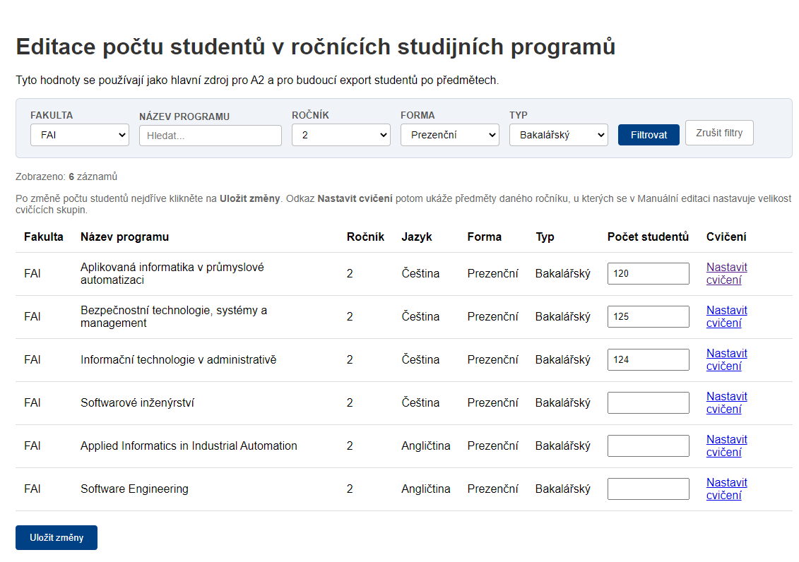

# 9 Cvičení studijního ročníku

Stránka Cvičení studijního ročníku slouží jako praktický mezikrok mezi editací počtu studentů a Manuální editací A.1. Po otevření z konkrétního ročníku zobrazí předměty, které mají v daném ročníku cvičení, a u každého předmětu nabídne proklik do Manuální editace na správnou zkratku a semestr.

## Ovládací prvky a tlačítka

| Prvek / tlačítko | Funkce | Návaznost |
| --- | --- | --- |
| Informační blok ročníku | Zobrazuje fakultu, název studijního programu, ročník, jazyk, formu, typ studia a počet studentů. | Pomáhá ověřit, že uživatel nastavuje cvičení pro správný ročník. |
| Zpět na ročníky | Vrací uživatele na stránku Editace počtu studentů v ročnících. | Slouží k návratu a případné změně počtu studentů. |
| Otevřít rozdělení cvičení | Přejde na stránku, která po nastavení maxima studentů dopočítá chybějící skupiny. | Navazuje na Manuální editaci A.1. |
| Nastavit v A.1 | Otevře Manuální editaci s filtrem na konkrétní předmět, semestr a pracoviště. | U daných řádků typu Cvičení se nastavuje sloupec Max. počet. |
| Aktuální max. počet | Ukazuje, zda už mají cvičení nastavenou velikost skupiny. | Pokud je uvedeno bez maxima, předmět se zatím na stránce Rozdělit cvičení neobjeví. |

## Poznámky k použití

- Nejprve je nutné uložit počet studentů v editaci ročníků. Poté uživatel otevře Nastavit cvičení, vybere konkrétní předmět a v Manuální editaci nastaví u řádků typu Cvičení hodnotu Max. počet, například 12 nebo 24.

## Screenshot

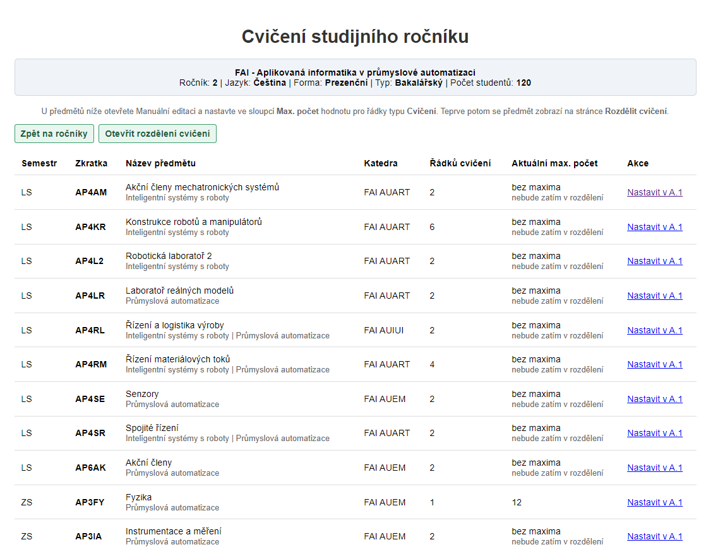

# 10 Rozdělení cvičení podle počtu studentů

Stránka vypočítá, kolik skupin cvičení je potřeba podle počtu studentů a maximálního počtu studentů na skupinu. Pokud je například 120 studentů a maximum 12 studentů na cvičení, výsledkem je potřeba 10 skupin.

## Ovládací prvky a tlačítka

| Prvek / tlačítko | Funkce | Návaznost |
| --- | --- | --- |
| Náhledová tabulka | Zobrazuje předmět, semestr, jazyk, počet studentů, maximum na skupinu, potřebu skupin, aktuální skupiny a počet k přidání. | Vychází z Manuální editace a počtů studentů v ročnících. |
| Rozdat tento | Přidá chybějící skupiny pouze pro jeden řádek. | Hodí se pro bezpečný postup po jednotlivých předmětech. |
| Provést vše | Přidá chybějící skupiny pro všechny zobrazené položky. | Používejte po kontrole náhledu. |
| Zpět na hlavní stránku | Vrací uživatele na úvodní stránku. | Navigační zkratka mimo hlavní menu. |

## Poznámky k použití

- Pokud je tabulka prázdná, zkontrolujte, zda jsou zadány počty studentů v ročnících a zda má alespoň jedno cvičení v A.1 nastavené maximum studentů.

## Screenshot

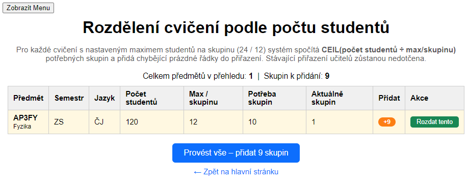

# 11 Přidání externisty

Formulář slouží k ručnímu založení externího vyučujícího. Nově je při založení povinně vybírána fakulta i pracoviště, aby externista fungoval také ve filtrech podle fakulty a katedry.

## Ovládací prvky a tlačítka

| Prvek / tlačítko | Funkce | Návaznost |
| --- | --- | --- |
| Titul | Volitelný výběr akademického titulu. | Seznam titulů se spravuje v Nastavení. |
| Fakulta | Výběr fakulty externisty. | Filtruje dostupná pracoviště ve formuláři. |
| Pracoviště | Výběr pracoviště externisty v aktivní verzi. | Ukládá se k učiteli a umožňuje filtrování v přehledech. |
| Jméno / Příjmení | Základní identifikace externisty. | Ukládá se do tabulky učitelů aktuální verze. |
| Email / Telefon / Jiné | Kontaktní údaje externisty. | Ukládají se do kontaktů pro aktuální verzi. |
| Vytvořit | Založí externistu se záporným identifikátorem ucitIdno. | Nový učitel je dostupný v Manuální editaci a přehledech. |

## Poznámky k použití

- Pokud se pro fakultu nezobrazí žádná pracoviště, znamená to, že pro aktivní verzi ještě nebyla načtena pracoviště dané fakulty.

## Screenshot

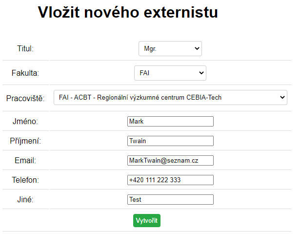

# 12 Přehled učitelů

Přehled učitelů zobrazuje vyučující aktivní verze, jejich pracoviště, kontakt a vytíženost. Slouží také jako místo pro hromadný export vybraných učitelů.

## Ovládací prvky a tlačítka

| Prvek / tlačítko | Funkce | Návaznost |
| --- | --- | --- |
| Jméno nebo příjmení | Vyhledá učitele podle textu. | Filtruje zobrazení i seznam pro export. |
| Fakulta / Katedra | Omezí seznam podle pracoviště. | Externisté se zobrazí správně, pokud mají vyplněné pracoviště. |
| Počet na stránce | Nastaví stránkování přehledu. | Volby 50 nebo 100 řádků. |
| Výběr učitelů pro export | Zaškrtávací seznam učitelů odpovídajících filtru. | Exportuje se jen vybraná množina. |
| Vybrat vše z filtru | Zaškrtne všechny učitele v aktuálním exportním výběru. | Zrychluje hromadný export fakulty nebo katedry. |
| Zrušit výběr | Odznačí všechny vybrané učitele. | Umožňuje začít výběr znovu. |
| Hledat v učitelích pro export | Lokální hledání v zaškrtávacím seznamu. | Nemění databázový filtr stránky. |
| Exportovat vybrané do Excelu | Vygeneruje Excel pro označené učitele. | Navazuje na exportní funkce pracovních úvazků. |
| Detail / Editace / Export | Akce u konkrétního učitele. | Otevírají detail úvazku, editaci údajů nebo export jednoho učitele. |

## Poznámky k použití

- Hranice přetížení a hodnota plného úvazku se nastavují na stránce Nastavení.

## Screenshot

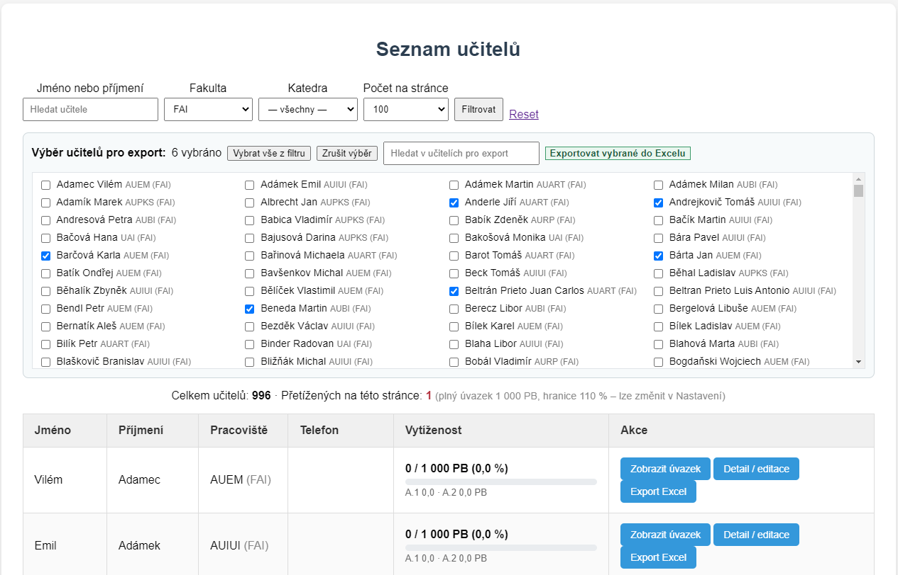

# 13 Detail úvazku učitele

Detail úvazku učitele spojuje souhrn pracovních bodů a podrobné položky A.1 a A.2. Je určen pro kontrolu jednoho konkrétního vyučujícího.

## Ovládací prvky a tlačítka

| Prvek / tlačítko | Funkce | Návaznost |
| --- | --- | --- |
| Souhrn PB | Zobrazuje celkový součet, kapacitu a procento vytíženosti. | Používá nastavení plného úvazku a koeficientů. |
| Tabulka A.1 | Zobrazuje přímou výuku, typ, jazyk, podíl, hodiny a PB. | Řádky odkazují zpět do Manuální editace. |
| Manuální editace | Otevře A.1 s filtrem na daný předmět a učitele. | Slouží k rychlé opravě chybného řádku. |
| Tabulka A.2 | Zobrazuje zkoušení a vypočtené PB. | Řádky odkazují na stránku Zkoušení. |
| Editace A.2 | Otevře stránku Zkoušení s příslušným filtrem. | Slouží k doplnění počtů zkoušek a zápočtů. |

## Screenshot

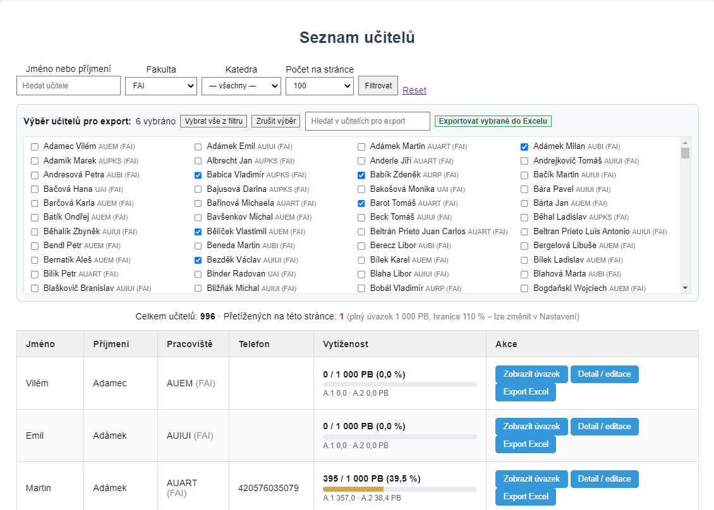

# 14 Detail a editace učitele

Editace učitele umožňuje změnit osobní a kontaktní údaje učitele v aktivní verzi a upravit profil pracovního úvazku.

## Ovládací prvky a tlačítka

| Prvek / tlačítko | Funkce | Návaznost |
| --- | --- | --- |
| Jméno / Příjmení | Editace základních údajů učitele. | Ukládá se pouze pro aktivní verzi. |
| Titul před / titul za | Ruční doplnění titulů u učitele. | Ovlivní zobrazení v přehledech a exportech podle implementace. |
| Email / Telefon / Poznámka | Editace kontaktních údajů. | Data jsou navázána na učitele a aktivní verzi. |
| Profil úvazku | Nastavení parametrů kapacity a dalších částí úvazku. | Vstupuje do výpočtu vytíženosti. |
| Uložit | Uloží provedené změny. | Po uložení se zobrazí potvrzení. |
| Zavřít | Zavře okno editace. | Používá se při otevření z přehledu učitelů. |

## Screenshot

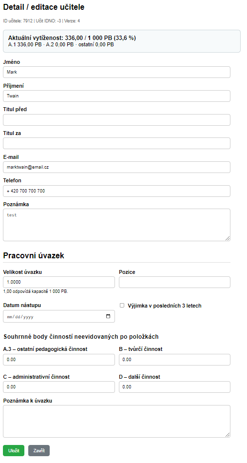

# 15 Nepokrytá výuka

Stránka vyhledává předměty nebo části výuky, které nejsou plně pokryté. Nepokrytá část znamená chybějícího učitele nebo součet podílů nižší než 100 %.

## Ovládací prvky a tlačítka

| Prvek / tlačítko | Funkce | Návaznost |
| --- | --- | --- |
| Statistické karty | Ukazují počet předmětů, nepokrytých předmětů, nepokrytých částí a procento pokrytí. | Rychlá kontrola kvality dat před exportem. |
| Fakulta / Katedra / Semestr | Filtry pro zúžení přehledu. | Pracují nad aktivní verzí. |
| Zkratka / Název | Textové hledání předmětu. | Pomáhá najít konkrétní problém. |
| Export do Excelu | Vyexportuje přehled nepokryté výuky podle aktuálních filtrů. | Vhodné jako příloha testování nebo kontroly. |
| Doplnit | Otevře Manuální editaci s filtrem na konkrétní předmět. | Slouží k opravě nepokryté výuky. |

## Poznámky k použití

- Pokud je vypnuté zahrnutí AJ výuk, anglické výuky se v této kontrole nezahrnují.

## Screenshot

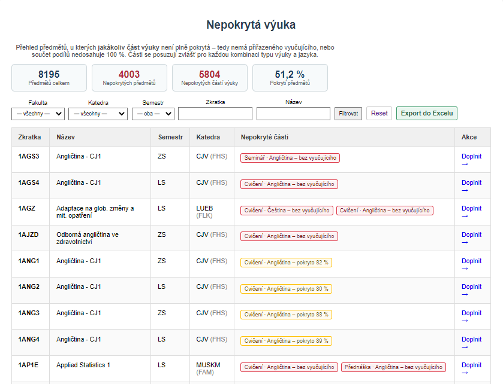

# 16 Nastavení systému

Nastavení systému obsahuje hodnoty, které ovlivňují výpočet pracovních bodů, zobrazení přetížení a dostupné tituly.

## Ovládací prvky a tlačítka

| Prvek / tlačítko | Funkce | Návaznost |
| --- | --- | --- |
| Přetížení nad | Nastaví procentní hranici, od které je učitel označen jako přetížený. | Používá se v Přehledu učitelů. |
| Plný úvazek PB | Nastaví jmenovatel pro výpočet vytíženosti. | Například 500 PB jako základ plného úvazku. |
| Koeficienty A.1 | Editace koeficientů pro přímou výuku podle druhu předmětu a typu výuky. | Ovlivňuje Manuální editaci, detail učitele a exporty. |
| Koeficienty A.2 | Editace koeficientů pro zkoušení. | Ovlivňuje stránku Zkoušení, detail učitele a exporty. |
| Uložit koeficienty | Uloží všechny změny koeficientů. | Platí pro aktivní verzi dat. |
| Přidat titul | Doplní nový titul do číselníku. | Titul se zobrazí při přidání externisty. |
| Smazat titul | Odstraní titul z číselníku. | Používejte jen u nepoužívaných hodnot. |

## Screenshot

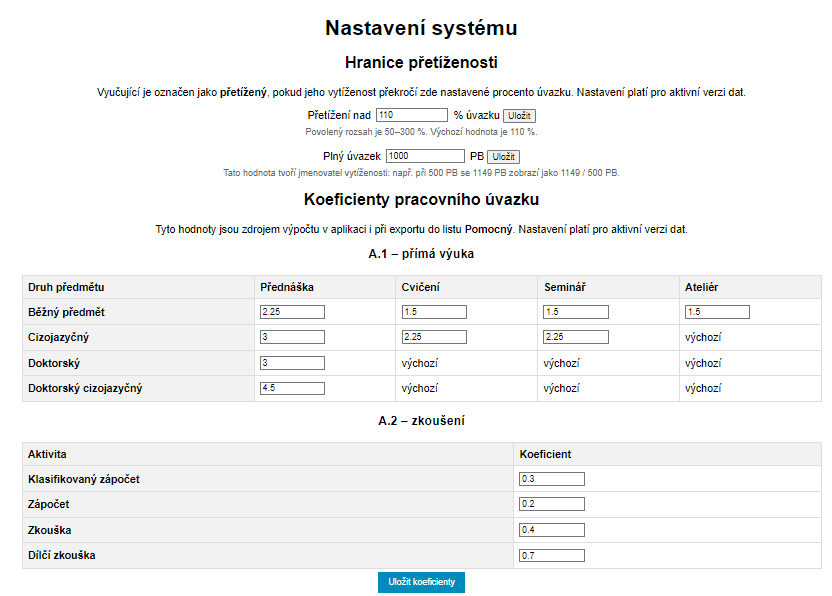

# 17 Rozcestník Edit

Rozcestník Edit soustřeďuje pomocné editace, které se běžně nepoužívají jako hlavní pracovní obrazovka, ale jsou důležité pro přípravu dat.

## Ovládací prvky a tlačítka

| Prvek / tlačítko | Funkce | Návaznost |
| --- | --- | --- |
| Přidat externistu | Otevře okno pro vytvoření externího vyučujícího. | Nový externista je následně dostupný v A.1. |
| Editace počtu studentů v ročnících | Otevře okno pro zadání počtů studentů. | Počty používá rozdělení cvičení. |
| Rozdělit cvičení podle počtu studentů | Přejde na stránku výpočtu skupin cvičení. | Navazuje na A.1 a počty studentů. |

## Screenshot

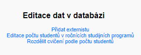

# 18 Exportní stránky

Exportní funkce vytvářejí soubory pro další práci mimo aplikaci, zejména v Excelu. Exporty vycházejí z aktivní verze dat a respektují nastavení koeficientů a zahrnutí anglických výuk.

## Ovládací prvky a tlačítka

| Prvek / tlačítko | Funkce | Návaznost |
| --- | --- | --- |
| Export úvazku učitele | Vygeneruje úvazek pro jednoho učitele. | Dostupné z Přehledu učitelů nebo detailu. |
| Export vybraných učitelů | Vygeneruje hromadný přehled vytíženosti pro označené učitele. | Dostupné ze stránky Přehled učitelů. |
| Export nepokryté výuky | Vygeneruje Excel s nepokrytými částmi výuky. | Dostupné ze stránky Nepokrytá výuka. |
| Export XLSX v A.1 | Vytvoří výstup pracovních úvazků. | Používá data z A.1, A.2 a nastavení koeficientů. |

## Screenshot

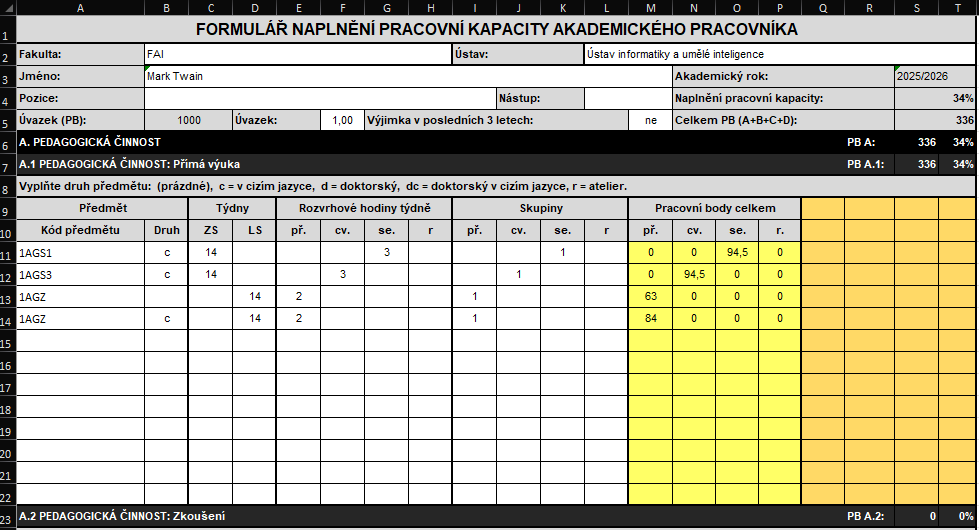

# 19 Technické a ladicí stránky

V projektu jsou také pomocné stránky určené pro vývojovou kontrolu, ladění a ověření dat. Běžný uživatel je používá jen při řešení problému.

## Ovládací prvky a tlačítka

| Prvek / tlačítko | Funkce | Návaznost |
| --- | --- | --- |
| debug-a2.php | Kontroluje data související se zkoušením A.2. | Používá se při nesouladu exportu nebo chybějících A.2 hodnotách. |
| clear-opcache.php | Pomocná stránka pro vyčištění PHP opcache. | Používá se při vývoji, pokud server drží starou verzi PHP souboru. |
| import-log-tail.php | Vrací poslední řádky importního logu pro stavový panel. | Volá se automaticky JavaScriptem během importu. |
| logs/importy | Složka s úplnými logy importu. | Užitečné pro dohledání chyb po dlouhém importu. |

## Poznámky k použití

- Tyto stránky nejsou primární pracovní tok. Do výsledné BP je vhodné popsat hlavně jejich účel při testování a diagnostice.

## Screenshot

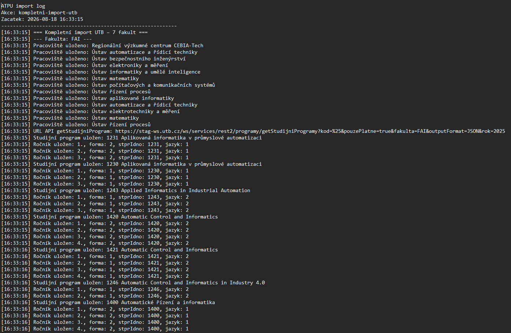

# 20 Přehled propojení mezi stránkami

| Prvek / tlačítko | Funkce | Návaznost |
| --- | --- | --- |
| Import dat -> Manuální editace | Import vytvoří předměty, učitele, pracoviště a předvyplněná přiřazení. | A.1 je hlavní místo ručních oprav. |
| Editace ročníků -> Rozdělit cvičení | Počty studentů určují potřebný počet skupin. | Bez počtů studentů nelze skupiny spolehlivě dopočítat. |
| Manuální editace -> Nepokrytá výuka | Nepokrytá výuka vyhodnocuje chybějící učitele a podíly z A.1. | Tlačítko Doplnit vrací uživatele zpět do A.1. |
| Manuální editace -> Detail učitele | Přiřazené řádky A.1 se promítají do detailu učitele. | Změny podílu a typu se projeví ve výpočtu PB. |
| Zkoušení -> Detail učitele | Počty A.2 se započítávají do souhrnu učitele. | Koeficienty se nastavují v Nastavení. |
| Přehled učitelů -> Exporty | Výběr učitelů určuje rozsah hromadného exportu. | Export používá aktuální data a nastavení. |
| Nastavení -> Přehledy a exporty | Koeficienty, plný úvazek a hranice přetížení mění výpočet a zobrazení. | Po změně nastavení je vhodné znovu zkontrolovat výstupy. |
| Editace ročníků -> Cvičení studijního ročníku | Tlačítko Nastavit cvičení zobrazí předměty daného ročníku s cvičeními. | Uživatel odtud pokračuje do Manuální editace A.1 a nastaví Max. počet. |
| Cvičení studijního ročníku -> Rozdělit cvičení | Po nastavení maxima studentů se předměty objeví ve výpočtu skupin. | Stránka Rozdělit cvičení dopočítá potřebný počet skupin podle počtu studentů. |

# 21 Kontrolní seznam před exportem

- Je aktivní správná verze dat.

- Je nastaven správný akademický rok.

- Import doběhl bez technické chyby a celý log je dostupný ve složce logs/importy.

- Je rozhodnuto, zda se mají zahrnovat anglické výuky.

- Externisté mají vyplněnou fakultu a pracoviště.

- Počty studentů v ročnících jsou doplněny pro potřebné programy.

- Cvičení s limitem studentů mají dopočítaný správný počet skupin.

- Manuální editace A.1 neobsahuje neočekávané nepokryté položky.

- Zkoušení A.2 je doplněno a odpovídá požadovaným počtům.

- Přehled učitelů neobsahuje neočekávaně přetížené nebo prázdné učitele.

- Nepokrytá výuka je zkontrolována nebo vyexportována pro další ruční kontrolu.
